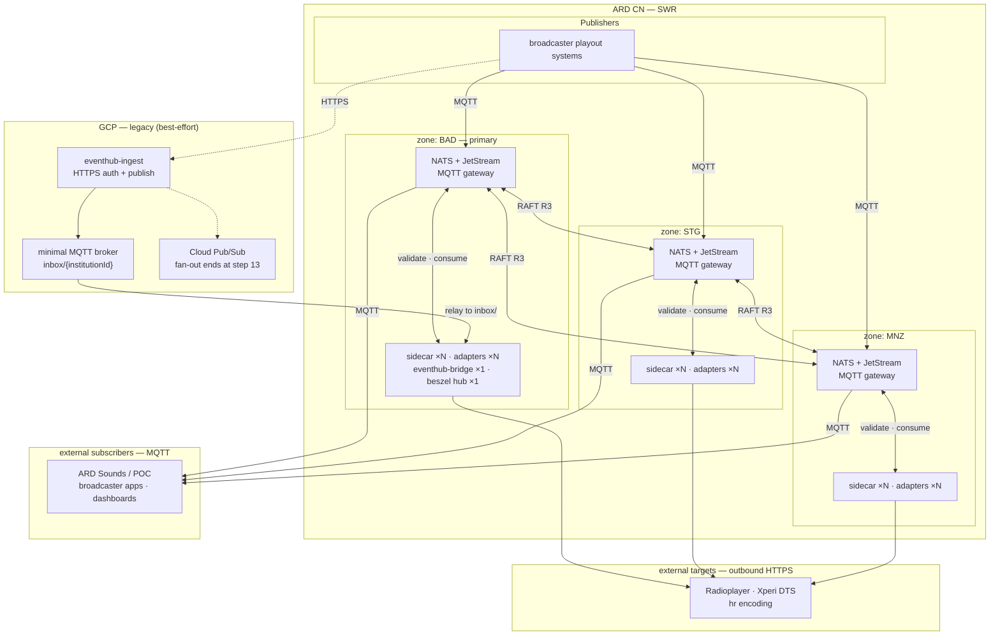

- **Status:** Draft — proposes change
- **Proposes:** `eventhub-connect`, a new deployment target inside the ARD CN
- **Last reviewed:** 2026-08-28
- **Tracking:** [issue #824](https://github.com/swrlab/ard-eventhub/issues/824),
  [discussion #771](https://github.com/swrlab/ard-eventhub/discussions/771)

> This page is written in English, unlike the rest of these docs. It is an engineering-context
> artifact aimed at maintainers and coding agents, not at publishers integrating with the API.
> For integration guides, start at _Benutzer-Guides_.

## 1. Why this document exists

v3 ships **`eventhub-connect`** as a redundant MQTT ingest, validation and plugin-publishing
platform inside the ARD CN, deployed as **three nodes across three SWR zones**, with a UI for
operators. The existing **`eventhub-ingest`** in GCP keeps serving broadcasters who have not
migrated, mirroring their events to a minimal MQTT broker that **`eventhub-bridge`** relays into the
CN. Once every broadcaster is on MQTT-in-CN, the GCP side is decommissioned (expected by mid to end of 2027).

_RFC 0001_ describes what runs today and why. This document does
not repeat it; it states what changes, what it costs, and what is still undecided
([§19](#19-open-decisions), [§20](#20-open-questions)).

What v3 fixes, in the order the pain is felt:

- **Every broadcaster needs a public HTTPS endpoint** to receive push subscriptions, which means
  firewall negotiation inside each broadcaster's own network. An outbound MQTT connection removes
  that entirely.
- **There is no path for control bits or radiotext.** Now-playing is the only event class, so TA,
  Regio and RT/DL+ still ride the ZI gateway this is meant to replace.
- **An ARD-internal workload depends on GCP** for its data plane.

What today's system gets right and v3 must not lose: it is simple to deploy, the schema is
genuinely enforced, and it is observable.

## 2. Terminology

"v3" is one effort in two phases, not two separate things — but the phases are easy to mistake for
each other, and one version number genuinely does not move.

- **Eventhub `3.x`** — the release line, currently `3.0.0-beta.1`. **Phase one, already shipped:**
  API cleanup, all of it breaking. Radiotext removed, `x-ard-eventhub-uid` dropped, `length`
  mandatory, `trace` deprecated. Documented for publishers in `docs/user/migration-v3.md`.
- **`eventhub-connect`** — what this RFC proposes: **phase two of the same v3 effort**, moving the
  transport and the data plane. It is a new deployment target, not a new version number, so shipping
  it does not imply a `4.x`.
- **`de.ard.eventhub.v1.*`** — the **event schema** version, and the one thing that does not move. It
  stays at `v1` throughout. Moving a publisher from HTTPS to MQTT is a transport change, not a schema
  change: the payload on `inbox/{institutionId}` is the same JSON the HTTPS API accepts today, and
  the two new event types (`radio.control`, `radio.data`) are additions to `v1`. This is the
  distinction most likely to trip someone up — **"Eventhub v3" never means `de.ard.eventhub.v3.*`.**

**The two phases are directly coupled**, which is the clearest evidence they are one effort rather
than two. `3.0.0-beta.1` removed the `radio.text` event type outright, leaving no radiotext path at
all, and this RFC reintroduces that capability as part of `radio.data`
([§13.2](#132-deardeventhubv1radiodata)). The removal cleared the way for the replacement rather than
being unrelated housekeeping.

## 3. North star

- **Bidirectional by default.** Publishers push to the broker over MQTT; subscribers consume on
  demand.
- **Sovereign in the ARD CN.** The data plane lives on three VMs in the CN. GCP is a sync peer, not
  the source of truth.
- **Schema at the edge.** Zod validation at the broker boundary; bad data never reaches subscribers.
- **One source of truth for radio events.** Track playing/next, control bits and radiotext share one
  broker, one topic tree, one set of consumers.
- **Self-contained.** No external SaaS in the data or observability path. The cluster runs,
  validates, routes and stays observable with zero internet access.
- **Infra as code.** Every VM and every workload lives in the repo; CI deploys; no manual prod edits.

## 4. Architecture

### 4.1 Three nodes, three zones

**Three `eventhub-connect` nodes across three SWR zones inside the ARD CN**, on near-identical
NixOS + K3S images, each running the same workloads.

Three is a hard requirement, not a scaling choice. The NATS MQTT gateway is backed by JetStream,
JetStream replication is RAFT, and RAFT quorum is `(R/2)+1`. At `R=3` quorum is 2, so the cluster
survives the clean loss of any single node and stays writable on the majority side of any partition.
At `R=2` quorum would be 2 of 2 — losing either node would take JetStream, and therefore MQTT, down
on the survivor as well. Node count alternatives are in [§21](#21-alternatives-considered).

The three zones are genuine failure domains — three separate SWR sites, not three racks in one
building. A third node co-located with an existing one would buy replica count but no partition
tolerance.

- `connect-bad` — Baden-Baden. **Primary**, in the narrow sense below.
- `connect-stg` — Stuttgart
- `connect-mnz` — Mainz

### 4.2 What "primary" means, and what it does not

BAD is primary in one deliberately narrow sense: **it is where the workloads that can only run once
are placed.** Currently `eventhub-bridge` and the Beszel hub.

It is **not** primary in the data path, and the distinction matters. NATS and JetStream are
symmetric across all three nodes; the RAFT leader is elected, not assigned, and can be any node at
any time. Clients connect to whichever endpoint answers, and no event needs BAD to be up. Losing BAD
costs exactly two things: legacy publishers stop being relayed (accepted —
[§12.7](#127-legacy-is-not-first-class)) and host-level uptime monitoring goes dark. Native MQTT
publishers, all subscribers, validation and plugin dispatch continue on the STG + MNZ quorum.

**The Beszel hub on BAD is a known soft spot.** It is the one observability component that becomes
unavailable in the failure where it would be most useful. Tolerable because it is host and uptime
monitoring rather than the metrics and logs path, and because losing it makes the cluster blind
rather than broken — but the SOC alerting path must not depend on it.

"Primary" is therefore a placement convention, not a role. It exists so single-instance workloads
have an unambiguous home and do not end up scheduled somewhere surprising after a drain.

### 4.3 What runs on each node

- A **NATS server** with the built-in [MQTT gateway](https://docs.nats.io/learn/mqtt/) — the public
  protocol publishers and subscribers connect to, with NATS subjects internally.
  **JetStream enabled**; the MQTT gateway requires it for sessions, retained messages and QoS 1.
- A **validation sidecar** — zod-validates every event at the broker boundary before fan-out
  ([§10.2](#102-validation-sidecar)).
- **`eventhub-bridge`** — relay from GCP into `inbox/{institutionId}`. Single instance, not HA.
- An **operator UI** — read-only, no login, intranet-scoped ([§14](#14-operator-ui)).
- The **ARD core feed loader** — hourly refresh of the mapping the ownership check depends on
  ([§8](#8-the-ard-core-feed)).
- The **cluster-internal observability stack** ([§15](#15-observability)).

During migration, GCP `eventhub-ingest` keeps accepting HTTPS posts and publishes raw events to
`inbox/{institutionId}` on a minimal MQTT broker, which `eventhub-bridge` relays into the CN.



## 5. Services and code structure

### 5.1 Built versus deployed

The first structural rule is a hard line between software we build and software we deploy.

- **Built** — three services, all TypeScript, all in this repo: `eventhub-connect`,
  `eventhub-bridge`, `eventhub-ingest`.
- **Deployed** — NATS and the whole observability stack. Upstream container images, configured by
  file, never forked and never wrapped. **We write no broker code.** NATS is deployed exactly like
  Vector or VictoriaMetrics: pull the official image, mount a config, run it. If something feels
  like it needs a patched NATS, that is a signal the design is wrong, not that we should fork.

Keeping that line sharp is what makes the system auditable: everything in the data path that we are
responsible for is in one repo, in one language, with one test suite.

### 5.2 One responsibility per service

The "does not" lines matter as much as the "does".

**`eventhub-connect`** — the CN platform. All NATS/MQTT handling, validation and plugin delivery.

- Owns: the NATS/MQTT connection surface, zod validation, the subject-versus-payload ownership
  check, the ARD feed loader, plugin eligibility and fan-out, the adapters that call external
  targets, and the operator UI.
- Does not: accept HTTPS event submissions, know anything about GCP, or talk to Pub/Sub.

**`eventhub-bridge`** — the GCP-to-CN relay, and nothing else.

- Owns: one MQTT subscription against the GCP broker, one MQTT publish into the CN's
  `inbox/{institutionId}`.
- Does not: validate, map topics, resolve institutions, or know that plugins exist. **If a code
  change to the bridge is ever needed because a schema changed, something has been put in the wrong
  place.**

**`eventhub-ingest`** — the GCP HTTPS shim, shrinking in behaviour but not in surface.

- Owns: TLS termination, token issuance (`/auth/login`, `/auth/refresh`, `/auth/reset`), request
  auth (Firebase JWT plus a user allow-list), and an MQTT publish of the raw event body.
- Does not: validate event payload schemas, dispatch plugins, or run its own fan-out.
- Keeps its **entire published route surface** until each route is formally deprecated
  ([§5.3](#53-the-ingest-api-surface-stays-until-it-is-deprecated)).

### 5.3 The ingest API surface stays until it is deprecated

**`eventhub-ingest` exposes a published, documented HTTP API with external consumers, and none of it
may be deleted as a side effect of internal refactoring.** Every route stays live, served and
maintained until it has been through an explicit deprecation cycle — announced, with a date, and
with measured zero traffic before removal.

The current surface:

- `POST /auth/login`, `/auth/refresh`, `/auth/reset` — token issuance.
- `POST /events/:eventName` — event ingest.
- `GET`/`POST` `/subscriptions`, `GET`/`DELETE` `/subscriptions/:name` — subscription management.
- `GET /topics`, `GET /topics/:topicName` — topic listing.
- `PUT`/`POST` `/pubsub` — Pub/Sub push handler and manual replay.
- `GET /`, `GET /health` — health checks.

**"Maintained" means maintained, not frozen.** These routes terminate TLS and verify tokens, so they
stay on patched dependencies with their tests green for as long as they are reachable. A route kept
alive but unmaintained is worse than one removed.

They do not all die at the same time, and conflating them is how a migration breaks somebody:

- **Short track — `/subscriptions`, `/topics`, `/pubsub`.** These only mean anything while Pub/Sub
  carries events; a subscription to a topic that receives nothing is a trap. Their deprecation is
  **coupled to the Pub/Sub shutdown**, not scheduled independently: notice while subscribers
  migrate, then `410 Gone`, then removal. This is why step 13 cannot simply switch Pub/Sub off.
- **Long track — `/events/:eventName` and `/auth/*`.** The actual legacy publishing path, surviving
  until the last HTTPS publisher moves to MQTT — the long tail of the whole migration. **`/auth/*`
  keeps the Firebase dependency alive for exactly as long as `/events` does**; dropping Firebase is
  gated on the last token consumer, not on the CN being ready.

The OpenAPI document keeps describing every live route accurately, including deprecation markers,
for as long as the route exists.

### 5.4 What shrinking ingest costs

`/events/:eventName` keeps its path, auth and documented request body, but stops enforcing the event
schema. **Today a bad payload gets a synchronous `400` with zod error detail; after the change it
gets a `202`, and the schema rejection happens later, in the CN.** Legacy publishers hold no MQTT
connection, so there is nowhere to deliver that rejection to them.

The trade is accepted for the same reason the rest of the legacy path is second-class: it is a
migration incentive, not a supported mode ([§12.7](#127-legacy-is-not-first-class)). Mitigations are
that the operator UI surfaces validation errors for bridged events with the publisher identity
attached, and that we chase houses directly rather than waiting for them to notice.

It also buys a real simplification: with validation in exactly one place, the two-zod-versions drift
problem disappears entirely rather than needing a detector.

### 5.5 Repo layout

The repo is already laid out for this — `src/schemas/`, `src/utils/`, and `#config` / `#env` /
`#types` aliases — so v3 adds service directories rather than restructuring:

```
src/
  schemas/     zod schemas — the event contract
  openapi/     openapi.json generation from schemas (build-time)
  types/       shared types (#types)
  utils/       genuinely shared helpers only
  connect/     eventhub-connect  — sidecar, adapters, feed loader, UI backend
  ingest/      eventhub-ingest   — HTTPS auth + MQTT publish
  bridge/      eventhub-bridge   — GCP → CN relay
deploy/        NATS + observability configs, K3S manifests, Nix flake
```

**`src/schemas/` is the single source of truth for the event contract**, imported rather than
reimplemented, with three consumers: `eventhub-connect` at runtime for event validation,
`src/openapi/` at build time for `openapi.json`, and `eventhub-ingest` for its own route schemas.

Be precise about what ingest stops importing at step 13: **it drops event-body validation
(`events.ts`) but keeps the request and response schemas for its surviving routes** (`auth.ts`,
`subscriptions.ts`, `topics.ts`, `common.ts`). Nothing in `src/schemas/` can be deleted while a live
route references it.

**`src/utils/` needs a deliberate split, not a wholesale move.** Most of it is ingest-specific by
accident of history and becomes `eventhub-connect`'s: `ard-feed`, `ard-core`, `events/`, `plugins/`.
The Pub/Sub and Datastore helpers get deleted with the fan-out. Only what more than one service
actually imports should stay in `utils/`, or it becomes the dumping ground that makes the service
boundaries above meaningless.

One build per service, three container images, one shared dependency graph. No monorepo tooling:
separate entry points in one package is enough at this size, and `package.json#main` already points
at a service entry point today.

## 6. Topics

### 6.1 MQTT to NATS translation

**This is the single most important implementation detail in the document.** The NATS MQTT gateway
does not pass topics through unchanged. It rewrites them, and getting this wrong produces
subscriptions that connect successfully and then silently receive nothing. The conversion is
implemented in `mqttToNATSSubjectConversion` (`server/mqtt.go`).

| On the wire (MQTT) | Internally (NATS subject) | Notes                                                                                     |
| ------------------ | ------------------------- | ----------------------------------------------------------------------------------------- |
| `/`                | `.`                       | topic level separator becomes subject token separator                                     |
| `.`                | `//`                      | **never use a dot in an MQTT topic** — it becomes two literal characters inside one token |
| `+`                | `*`                       | single-level wildcard                                                                     |
| `#`                | `>`                       | multi-level wildcard                                                                      |
| `:`                | `:`                       | unchanged — URNs are safe as a single token                                               |
| space, tab, CR, LF | _rejected_                | connection or publish fails                                                               |

Practical consequences:

- **Clients speak `/`, `#`, `+`.** A publisher targeting subject
  `inbox.urn:ard:institution:a3004ff924ece1a2` publishes to MQTT topic
  `inbox/urn:ard:institution:a3004ff924ece1a2`. Publishing to `inbox.urn:…` over MQTT instead lands
  on subject `inbox//urn:…` — one token — which nothing is subscribed to.
- **ACLs are written in NATS subject syntax.** The server config says `inbox.urn:…`; the wire says
  `inbox/urn:…`. Same thing, two notations. Expect this to confuse people at least once.
- **The URNs themselves are inert.** Neither institution nor livestream URNs contain a `.` or a `/`,
  so each stays a single token in both notations and needs no escaping. This is the property that
  lets the whole tree use raw URNs.
- **NATS is MQTT v3.1.1 only.** A client requesting MQTT 5 is rejected at connect with CONNACK
  return code 1, "unacceptable protocol version" — so no correlation data, response topics, user
  properties, session expiry or shared subscriptions. QoS 0, 1 and 2 are all supported (2.10+). The
  missing shared subscriptions shape the internal topology
  ([§10.1](#101-work-that-scales-consumes-nats-side)).

### 6.2 Topic tree

NATS subjects are the source of truth. Both notations are given.

| Purpose                          | NATS subject                             | MQTT topic                           |
| -------------------------------- | ---------------------------------------- | ------------------------------------ |
| raw ingest, one per organization | `inbox.{institutionId}`                  | `inbox/{institutionId}`              |
| validation feedback to publisher | `feedback.{institutionId}`               | `feedback/{institutionId}`           |
| validated now-playing            | `radio.{livestreamId}.track.playing`     | `radio/{livestreamId}/track/playing` |
| validated next track             | `radio.{livestreamId}.track.next`        | `radio/{livestreamId}/track/next`    |
| control bits (TA, Regio, …)      | `radio.{livestreamId}.control`           | `radio/{livestreamId}/control`       |
| radiotext + dynamic label + DL+  | `radio.{livestreamId}.data`              | `radio/{livestreamId}/data`          |
| per-target plugin work queue     | `plugin.{target}.{livestreamId}.{class}` | _not exposed_                        |

`{institutionId}` is the ARD institution URN, e.g. `urn:ard:institution:a3004ff924ece1a2` for SWR.
`{livestreamId}` is the livestream URN, e.g. `urn:ard:permanent-livestream:49267f7d67be180d`.
`{target}` is a plugin target (`radioplayer`, `dts`, …). `{class}` is the event class as it appears
in the `radio.` tree (`track.playing`, `track.next`, `control`, `data`).

**The whole tree is URNs, not human-readable names.** The institution URN is the string the ARD core
feed returns as `publisher.institution.id`, so the ownership check guarding every event becomes a
direct string comparison between subject token and feed
([§8.2](#82-ownership-is-a-direct-comparison)) — no mapping table, no join key, nothing to keep in
sync. The cost is topic length: a broadcaster configures
`inbox/urn:ard:institution:a3004ff924ece1a2` rather than `inbox/swr`. That is a real ergonomic loss,
paid once at provisioning, in exchange for deleting an authorization mapping table — and it is the
same `urn:ard:…` shape publishers already send today in `services[].publisherId`.

**The livestream comes before the event class, at a fixed depth.** This is deliberate. The dominant
subscriber pattern is "everything for stream X" (encoders, broadcaster apps), and putting the ID
last would make that impossible to express: `radio.*.{urn}` matches three-token subjects only, so it
would catch `control` and `data` but never `track.playing`. ID-first keeps both access patterns
available and turns per-stream ACLs into a prefix match, which is what NATS permissions express
naturally.

**`plugin.>` is internal.** No MQTT user holds any permission on it, in either direction. It exists
because plugin eligibility is a per-event decision ([§10.3](#103-plugin-routing)).

Publishers **publish only** to `inbox/{institutionId}` and **subscribe only** to
`feedback/{institutionId}`. The `radio.`, `feedback.` and `plugin.` trees are written exclusively by
the sidecar. `eventhub-bridge` is just another writer to `inbox/{institutionId}`.

### 6.3 Subscription patterns

| Intent                              | MQTT filter                                                         | NATS subject                                                        |
| ----------------------------------- | ------------------------------------------------------------------- | ------------------------------------------------------------------- |
| everything                          | `radio/#`                                                           | `radio.>`                                                           |
| one livestream, all event types     | `radio/urn:ard:permanent-livestream:49267f7d67be180d/#`             | `radio.urn:ard:permanent-livestream:49267f7d67be180d.>`             |
| one event type, all livestreams     | `radio/+/track/playing`                                             | `radio.*.track.playing`                                             |
| one livestream, one event type      | `radio/urn:ard:permanent-livestream:49267f7d67be180d/track/playing` | `radio.urn:ard:permanent-livestream:49267f7d67be180d.track.playing` |
| all track events for one livestream | `radio/urn:ard:permanent-livestream:49267f7d67be180d/track/+`       | `radio.urn:ard:permanent-livestream:49267f7d67be180d.track.*`       |

### 6.4 Migration note for existing subscribers

Today's Pub/Sub topic names percent-encode the URN —
`de.ard.eventhub.prod.urn%3Aard%3Apermanent-livestream%3A49267f7d67be180d`. MQTT and NATS both
accept a raw colon, so v3 drops the encoding entirely. This is a breaking change for every
subscriber, and a good one: the topic becomes readable and the `pubsubBuildId` / `convert-id`
encode-decode pair goes away.

## 7. Auth and ACL

**Decision: static config users with bcrypt-hashed passwords, one user per principal, scoped to
MQTT, over mandatory TLS.** Not operator/JWT mode.

### 7.1 Why not JWT

NATS decentralized (operator) auth is the more powerful model and what you would reach for with many
tenants managing their own users. It is the wrong fit here, for three reasons.

**MQTT can't do the NATS handshake.** NATS-native JWT auth verifies an NKEY signature over a
server-issued nonce, and MQTT has no nonce exchange. `nats-server` works around this — `auth.go` has
an explicit branch, _"MQTT can carry JWTs in the password field"_ — but the JWT must then be marked
a **bearer token**, which tells the server to skip signature verification entirely. The client never
signs anything and never needs the NKEY seed; the JWT alone is the credential, and anyone who
captures it can impersonate that publisher until it expires. The security advantage largely
evaporates at the MQTT edge.

**It puts token-refresh logic in every broadcaster's playout system.** Short-lived credentials mean
each house implements refresh-before-expiry and reconnect — exactly the kind of code that gets
implemented badly, or not at all, in systems we do not control and cannot debug. A static credential
has no refresh path to get wrong.

**We don't need the scale it buys.** Roughly ten publisher orgs and a handful of subscriber roles,
all provisioned by one team. That is the textbook case for centralized config auth, and the NATS
docs say so directly.

### 7.2 Username convention and rotation

Publisher and subscriber credentials are separate user classes with separate naming rules. The split
is what makes the config auditable at a glance.

- **Publishers:** `pub-{label}-{issued}`, e.g. `pub-swr-2026-06-26`. The `pub-` prefix is mandatory
  and reserved — anything carrying it publishes to exactly one `inbox.{institutionId}`, and nothing
  else in the config may use it.
- **Subscribers:** a descriptive role name plus issuance date, e.g. `sub-radioplayer-2026-06-26`,
  `sub-ard-sounds-2026-06-26`. Naming is deliberately looser, because subscriber scopes vary and new
  consumers appear more often than new publishers. The `sub-` prefix is a convention, not a rule the
  ACLs depend on.
- **Services:** `svc-sidecar`, `svc-adapter-{target}`, `svc-bridge`. NATS-native, not MQTT, and not
  rotated on the same cadence.

**The username is a label for humans; the institution URN in the subject is the contract.** The
`swr` in `pub-swr-2026-06-26` is not parsed, matched or resolved by anything — the ACL binds that
user to exactly one `inbox.urn:ard:institution:…`, and the sidecar reads the institution from the
subject the message arrived on. Keeping a readable label is deliberate: the operator UI groups
connections by username, and `pub-swr-2026-06-26` tells an operator what a 16-hex-character hash
does not.

The date suffix is what turns "no expiry" from a weakness into a workable process, because rotation
becomes additive rather than destructive:

1. Add `pub-swr-2027-01-15` alongside `pub-swr-2026-06-26`, identical permissions, new password.
2. Reload the config. Both credentials now work.
3. The house switches its client whenever it suits them.
4. Once the operator UI shows no connections on the old user, remove it and reload again.

No coordinated cutover, no downtime window, and no window during which a slow house is locked out.
**The switch is seamless for the client**, because MQTT session state is keyed by client ID within
an account, not by user: a publisher reconnecting with the same client ID and a new username resumes
its existing persistent session, queued QoS 1 messages and all. This is one of the reasons the
design uses a single account. The date never appears in a topic, so rotating changes nothing for the
publisher's topic configuration and nothing for any subscriber.

It also makes credential age visible. A `pub-*` user with a 2026 date still in the config in 2028 is
an obvious audit finding, in a way that a bare `pub-swr` never would be.

### 7.3 The config

Users live in the `authorization` block of the NATS config, which is **hot-reloadable** — adding or
revoking a user is a config change plus `nats-server --signal reload`, with no restart and no
dropped connections for anyone else.

```conf
authorization {
  users: [
    # publisher: one per organization, per issuance. publish-only into its own inbox.
    # the subject carries the institution URN; the username is just a readable label.
    {
      user: "pub-swr-2026-06-26"
      password: "$2a$11$4I9tIK1JVbttZYtn.F.Jse5iY5ves4EtYWIpjlwyvgVYHJc8yTvk."
      allowed_connection_types: ["MQTT"]
      permissions: {
        publish:   { allow: ["inbox.urn:ard:institution:a3004ff924ece1a2"] }
        subscribe: { allow: ["feedback.urn:ard:institution:a3004ff924ece1a2"] }
      }
    }

    # subscriber: one per external consumer role, scoped to what it needs. never publishes.
    {
      user: "sub-ard-sounds-2026-06-26"
      password: "$2a$11$..."
      allowed_connection_types: ["MQTT"]
      permissions: {
        subscribe: { allow: ["radio.*.track.playing", "radio.*.track.next"] }
        publish:   { deny:  [">"] }
      }
    }

    # service: the validation sidecar. NATS-native, plus an MQTT connection for retained publishes.
    {
      user: "svc-sidecar"
      password: "$2a$11$..."
      permissions: {
        subscribe: { allow: ["inbox.>"] }
        publish:   { allow: ["radio.>", "feedback.>", "plugin.>"] }
      }
    }

    # service: one per plugin adapter. reads only its own work queue, publishes nothing.
    {
      user: "svc-adapter-radioplayer"
      password: "$2a$11$..."
      permissions: {
        subscribe: { allow: ["plugin.radioplayer.>"] }
        publish:   { deny:  [">"] }
      }
    }

    # service: the legacy relay. writes only to inbox, like any other publisher.
    {
      user: "svc-bridge"
      password: "$2a$11$..."
      permissions: {
        publish:   { allow: ["inbox.>"] }
        subscribe: { deny:  [">"] }
      }
    }
  ]
}
```

- **Passwords are bcrypt hashes**, generated with `nats server passwd`. The config in git holds the
  hash; the client still sends the plaintext, so bcrypt protects the config at rest, not the wire.
  TLS does the wire.
- **`allowed_connection_types: ["MQTT"]`** pins publisher and subscriber credentials to the MQTT
  listener, so a leaked publisher password cannot open a NATS-native connection.
- **Permissions are NATS subject patterns** — dots, `*`, `>`. See
  [§6.1](#61-mqtt-to-nats-translation).
- **Publishers never subscribe to `radio.>` and subscribers never publish anything.** A publisher
  that also wants to consume gets a second, `sub-` prefixed credential. Keeping the classes disjoint
  means a compromised publisher credential cannot read the whole event stream, and a compromised
  subscriber credential cannot inject anything.
- **`no_auth_user` is not set**, so an unauthenticated connect fails. This is the specific line
  [Q2](#192-q2--can-subscriber-paths-be-made-freely-available-with-no-user-auth) proposes reversing
  for read-only subscribers.
- **No MQTT credential has any permission on `plugin.>`.** It is reachable only by NATS-native
  service users, and each adapter sees only its own target's subtree, so a compromised adapter
  credential cannot read another target's queue.

### 7.4 The ACL protects the subject, not the payload

This is the gap a subject-scoped ACL cannot close on its own. `pub-swr-2026-06-26` can only write to
`inbox.urn:ard:institution:a3004ff924ece1a2`, but nothing at the broker level stops it publishing a
payload whose `services[]` array claims an NDR livestream.

**The sidecar must therefore verify that every service in the payload belongs to the institution
taken from the subject** — never from the payload. This is the same institution-ownership check
`processEvent` does today (`blocked: "User unauthorized for service"`); it moves into the sidecar and
takes its trusted input from the subject token. The data behind it is the ARD core feed
([§8](#8-the-ard-core-feed)).

### 7.5 Residual risk

Credentials do not expire on their own, so a leaked password is valid until someone rotates it. That
is the accepted trade for removing refresh logic from ten houses' playout systems. Mitigations: TLS
is mandatory, the blast radius of any single leak is one publisher's inbox or one subscriber's read
scope, the issuance date makes stale credentials visible, and revocation is one config reload away.

## 8. The ARD core feed

The ownership check needs to resolve a livestream URN to the organization that owns it. That mapping
comes from the ARD core livestream feed — one JSON document containing every livestream, each with
its `publisher`, each publisher with its `institution`. `eventhub-ingest` already consumes it
(`src/utils/ard-feed.ts`, `just feed`); the v3 loader keeps the same shape but changes the failure
behaviour substantially.

### 8.1 What it is used for

- **Authorization.** `livestreamId` → `publisher` → `institution.id`, compared against the
  institution URN in the subject. This is the only security-relevant use, and the reason the rest of
  this section is as defensive as it is.
- **Validation.** Rejecting events for livestream URNs that do not exist at all.
- **Enrichment.** Publisher title, image and homepage for the operator UI and for adapters that need
  station names.

### 8.2 Ownership is a direct comparison

Because the subject carries the institution URN, the check is string equality between two ids:

```
subject:  inbox.urn:ard:institution:a3004ff924ece1a2   ← trusted, enforced by the ACL
feed:     livestreamId → publisher.institution.id      ← urn:ard:institution:a3004ff924ece1a2
```

Equal means accept; different means `blocked`. **There is no mapping table and no join key** — no
`slug → institution` config to maintain, drift, or get wrong, and no place where a rename silently
widens access. Two properties make this safe:

- **The ACL is the pinning.** The binding between a credential and an institution is expressed once,
  in the ACL, and reviewed in the same PR that creates the user. The review gate did not disappear
  with the mapping table; it moved to where it belongs.
- **Nothing authorization-relevant reads a mutable upstream string.** `institution.acronym` and
  `institution.title` are display fields and must never be used as join keys — an acronym change
  upstream would break a house's publishing, and a collision or blanked field could widen access.
  Ids only, on both sides.

The feed still has to be trusted for `livestreamId → institution.id`, which is why the integrity
rules below exist.

### 8.3 Refresh through JetStream KV

An hourly K3S CronJob fetches the feed, validates it, and on success writes it to a **JetStream KV
bucket**. Every sidecar watches that key. Preferred over each node fetching independently because:

- **All three nodes converge on the same version.** With independent fetches, node A can accept an
  event node B would reject. The skew is bounded by the refresh interval and self-corrects, but it
  is an avoidable class of "works on one node" bug.
- **RAFT replication is already there**, so the feed inherits the cluster's replication rather than
  needing shared storage.
- **KV revision history gives the previous-version requirement natively**, including rollback to a
  known-good revision without re-fetching from an upstream that may still be broken.
- **A KV watch means no polling.**

If KV turns out awkward, the fallback is a per-node fetch to a local file with the same
validate-then-swap discipline, and the version skew then has to be visible in the UI. **One fetcher,
many watchers** is the preferred shape either way — upstream should see one request per hour, not one
per pod per hour.

### 8.4 Staleness is safe, silence is not

This is where the current implementation is wrong and must not be carried over. `getARDFeed` calls
`process.exit(1)` on any failure — non-200, malformed JSON, timeout, or a failed integrity rule. On
a node restart during an internet outage, the service does not come up at all.

The v3 rules:

1. **Validate before swapping.** Fetch into a candidate, run every integrity rule, and only then
   atomically replace the active feed. A failed refresh is a no-op that leaves the previous version
   serving.
2. **Never fail closed on feed age.** A stale feed keeps authorizing events indefinitely. Rejecting
   valid events because an upstream CMS is unreachable would be a self-inflicted outage, and the
   feed's contents change on the order of weeks while an outage lasts hours.
3. **Persist the last good copy** to disk or KV so a cold start with no network still comes up
   working. This is the specific case the current design fails hardest.
4. **Ship a bootstrap copy in the image.** A brand-new node with no network and no persisted state
   must still start; the Nix store gives this for free.
5. **Make the age loud.** Serving stale is safe; not knowing you are is not. Warn at 3 hours (three
   missed refreshes), alert at 12, page at 48, and show feed age and active revision on the UI front
   page. A silently stale feed is the failure mode this design trades for, so it is the one that has
   to be visible.

### 8.5 Poison-feed protection

The feed is an authorization input, so a truncated or half-populated upstream response could
silently revoke a house's ability to publish. The existing integrity rules stay and get extended. A
candidate is rejected — keeping the previous version — if any of these fail:

- **Item count outside bounds.** Currently `minItems: 190`, `maxItems: 251`. Cheap guard against a
  truncated or paginated response.
- **Pagination present.** `totalPageCount > 1` means we are seeing a partial feed.
- **Required stations missing.** The existing hardcoded canary list (`WDR 2`, `1LIVE`, `SWR3`,
  `hr3`, …).
- **Institution count dropped** relative to the active version.
- **Any publisher with a live connection disappeared.** This is the rule that catches the case that
  actually hurts: an upstream edit that would break a publisher mid-broadcast. Connection state is
  already known from the broker, so the check is local.
- **`generated` is not newer** than the active version. Rejects replays and clock-confused upstream
  responses.

### 8.6 Carry-overs

- **`TEMP_PUBLISHER_MAPPING`** — eleven hardcoded publisher-id remaps in `ard-core.ts`, dated by
  their own name. Either the upstream ids get fixed or this becomes explicit config with an owner
  and a review date ([Q7](#197-q7--temp_publisher_mapping)).
- **`allowed-livestreams.json`** — the overlay for COMMON_IDS livestreams absent from the feed. It
  survives into v3 as an explicit overlay applied after the feed loads, under the same rule as
  everything else here: the institution comes from pinned config, not from the overlay's own claims.
- **Index on load.** `publisherLookup.getById` does a linear scan over ~200 items per lookup.
  Irrelevant at today's 0.3 msg/s and still cheap at cyclic `radio.data` volume, but there is no
  reason not to build a `Map` when the feed is swapped in.

## 9. Delivery semantics and latency

### 9.1 Per event class

Not all events want the same reliability, and one policy across all of them gets control events
wrong.

- **`radio.control` — durable.** A dropped `{"name": "TA", "state": false}` leaves the
  traffic-announcement bit stuck on, which is a broadcast fault, not a cosmetic one. Three nodes with
  JetStream give genuine at-least-once delivery: QoS 1 with a persistent session survives a
  subscriber reconnect, and RAFT quorum survives a node loss. **`validUntil` is a backstop, not the
  mechanism** — receivers drop the state when the TTL passes, so a lost off-event self-corrects
  instead of persisting indefinitely, but the explicit `state: false` event remains the primary path.
  No cyclic re-assertion.
- **`radio.data` — cyclic from the source.** The `cycle` field carries the source's own repeat
  interval, so a missed message self-heals within one cycle without any broker-side guarantee. This
  is how RT/DL+ already behaves and it keeps the non-goal of not rebuilding UECP intact.
- **`radio.track.playing` / `.next` — last value wins.** Stale-by-one is cosmetic.

**Retained messages are the late-joiner fix.** An encoder that reboots mid-song has, with no
retention, nothing to show until the next event — minutes for track events, potentially hours for
control. MQTT retained messages solve this and are stored in JetStream (`$MQTT_rmsgs`), which is
another reason JetStream is not optional.

### 9.2 The 220 ms budget

The **ZI Gateway functional specification sets 250 ms as the processing limit, of which 30 ms is ARD
CN transit.** That leaves **220 ms for everything Eventhub does** between a publisher's `PUBLISH`
and a subscriber receiving the validated event.

The budget binds `radio.control`: a now-playing event arriving 400 ms late is invisible, a TA bit
arriving late is a missed announcement. Since all classes share one path, meeting it for control
means meeting it for everything.

Where the 220 ms goes:

1. **JetStream write to the `inbox` stream at `R=3`** — a RAFT quorum commit, so roughly one
   inter-zone round trip plus fsync.
2. **Sidecar consumer delivery** — see [§9.3](#93-the-pull-consumer-latency-trap).
3. **Zod validation, feed lookup, plugin eligibility** — in-memory, sub-millisecond, not worth
   optimising.
4. **MQTT publish with RETAIN to `radio.…`** — a second quorum commit, plus the retained-message
   write.
5. **Fan-out to subscribers** — core NATS, negligible.

**The two RAFT commits dominate, and the three-zone spread is what makes them cost anything.** A
single-zone cluster would commit in well under a millisecond; BAD ↔ STG ↔ MNZ makes each commit an
inter-zone round trip. That is the price of partition tolerance and worth paying at this budget — but
it means **the inter-zone RTT is the number that decides whether the design fits**, which is why it
is an open question rather than an assumption ([§20](#20-open-questions)).

Measurement: the end-to-end latency metric in [§15](#15-observability) becomes a **p99 SLO against
the 220 ms**, instrumented per stage so a regression points at a hop rather than at the system.
Without the per-stage split, a budget breach is unactionable.

### 9.3 The pull-consumer latency trap

This is the one place where a correct-looking implementation blows the budget. **A JetStream pull
consumer only delivers while a fetch is outstanding.** The naive loop — fetch a batch, process it,
fetch again — means a message arriving just after a fetch returns waits for the next fetch. Broker
latency silently becomes poll latency, and at 220 ms that is fatal. So:

- **Always keep a fetch parked at the server.** Issue the next long-poll fetch _before_ processing
  the current batch, so there is never a window with no outstanding request. The server then
  delivers the instant a message lands and the pull-versus-push latency gap effectively vanishes.
- **Small `batch`, long `expires`.** A large batch encourages the server to wait for it to fill;
  long expiry keeps the parked fetch alive without churn.
- **Never sleep between fetches.** Any backoff belongs on error paths only.

### 9.4 Control events can be head-of-line blocked

A genuine structural limit rather than a tuning detail. **`inbox.{institutionId}` does not encode the
event class** — the class lives in the payload's `type` field — so a JetStream consumer on `inbox.>`
cannot filter or prioritise by class. Every event for an organization goes through one durable
consumer in arrival order.

That matters because `radio.data` is about to become the dominant volume: cyclic data at `cycle: 8`
across ~60 livestreams is roughly 7.5 msg/s against today's ~0.3 msg/s. A TA event arriving behind a
burst of cyclic data waits for it. `max_ack_pending` and multiple sidecar pods reduce the exposure
but cannot remove it, because the ordering is in the stream, not the consumer.

The fix, if wanted, is a **class token in the inbox subject** — `inbox/{institutionId}/{class}` —
allowing a dedicated, separately-tuned consumer for `inbox.*.control`. It costs a slightly wider
client contract and requires validating the payload's `type` against the subject token (one more
subject-versus-payload check, exactly like the ownership check). It also buys **per-class publish
ACLs**, so a house can be granted now-playing without being granted the authority to assert TA.
Recommended; see [Q4](#194-q4--class-token-in-the-inbox-subject).

## 10. Internal topology and scaling

### 10.1 Work that scales consumes NATS-side

**MQTT 3.1.1 has no shared subscriptions.** Every MQTT subscriber on a topic receives every message,
so no MQTT-consuming workload can run more than one instance without doing the work twice. That
single fact decides the internal topology: every consumer that needs to scale consumes on the
**NATS** side, and touches MQTT only where it needs an MQTT-specific feature.

NATS offers two once-only mechanisms:

- **Core queue groups** — each message goes to exactly one group member. Lowest latency, but
  fire-and-forget: if the member dies mid-processing the message is gone, with no redelivery.
- **JetStream durable consumers** — each message goes to exactly one puller, with explicit ack and
  redelivery on timeout. Costs one extra round trip; survives a pod dying mid-work.

**Both internal tiers use JetStream consumers.** Core queue groups are named here because they are
the obvious first reach and the wrong call in both places.

### 10.2 Validation sidecar

**JetStream pull consumer**, durable `sidecar`, filter `inbox.>`, `ack_policy: explicit`. Ack after
the validated event has been republished, not on receipt.

A core queue group would also stop multiple pods republishing the same event, and would be a little
faster — but the publisher has already received its QoS 1 PUBACK by then, so a pod dying between
receipt and republish loses the event silently and nobody finds out. That quietly breaks the
durability promise for `radio.control` and makes every rolling restart lossy. The extra round trip is
low single-digit ms inside the CN; paying it makes the guarantee real.

- `max_ack_pending` sized to pod count × desired concurrency.
- `max_deliver: 3` with a short `ack_wait`. A message that fails validation is not retried — it is
  `term`ed and reported on `feedback/{institutionId}`. Redelivery exists for crashes, not bad data.
- **A fetch is always outstanding** ([§9.3](#93-the-pull-consumer-latency-trap)). This is a hard
  requirement, not a tuning preference.
- **Each pod needs a distinct MQTT client ID** on its publish connection, derived from the pod name.
  Two pods sharing a client ID means the broker evicts one on every connect and they fight in a
  reconnect loop.

Each pod holds two connections, because the two publish paths need different protocols: **MQTT** to
publish `radio/…` with the **RETAIN** flag, which has no documented NATS-side equivalent, and
**NATS-native** to pull `inbox.>` and publish the `plugin.{target}.…` fan-out.

### 10.3 Plugin routing

**Plugin eligibility is a per-event decision, not a property of a subject.** A publisher sets
`plugins[]` on the event, and the auto-enable rule only covers music `track.playing` — `track.next`
never auto-enables. So two `radio.{id}.track.playing` events on the same subject can have completely
different plugin targets, and an adapter cannot decide what to deliver by filtering `radio.>`.
Subject-filtering the public tree would push every track event at every target, ignoring what the
publisher asked for.

So the sidecar resolves eligibility and **fans out to a dedicated per-target subject**. It already
holds the payload and the plugin config at that point, and it is the same thing `processEvent` does
today when it publishes one Pub/Sub message per enabled plugin. For each validated event the sidecar
publishes:

1. **`radio.{livestreamId}.{class}`** over MQTT with RETAIN — the public tree, unconditional, every
   subscriber sees it.
2. **`plugin.{target}.{livestreamId}.{class}`** NATS-native, **once per enabled target, and only for
   enabled targets.** No plugins on the event means nothing is published here at all.

The public tree stays clean — no plugin metadata leaks into what subscribers see — and adapters carry
no eligibility logic whatsoever. The subject _is_ the routing decision. Plugin subjects are **not
retained**: a work queue should not have a last-value, and an adapter coming back after a restart
wants its consumer backlog, not the last event replayed at it.

### 10.4 Plugin adapters

Adapters live inside `eventhub-connect`. Each takes a message off its own work queue and delivers it
to its target over outbound HTTPS.

- **One JetStream stream, `PLUGINS`, capturing `plugin.>`**, with a short `max_age`.
- **One durable pull consumer per target**, filtered on `plugin.{target}.>` — `adapter-radioplayer`
  on `plugin.radioplayer.>`, `adapter-dts` on `plugin.dts.>`. **Not one shared consumer with
  dispatch on a field.** Per-target consumers give independent failure domains: if
  Radioplayer is timing out, its ack-pending backs up and its lag climbs while DTS is untouched. A
  shared consumer lets one slow target eat everyone's capacity.
- **All pods for a target pull from that target's durable consumer.** Each message is delivered once;
  adding a pod adds concurrency with no config change and no coordination.
- **`max_ack_pending` is the concurrency limit and the backpressure knob** — it caps in-flight HTTPS
  requests per target. This, not a refusal to retry, is what keeps a slow target from wedging the
  pipeline.
- On HTTP failure: `nak` with a short delay, or `term` to drop immediately. `max_deliver` caps total
  attempts.
- **Adding a target is a sidecar config change plus a consumer and a Deployment.** No change to the
  `radio.` tree, no change for any publisher or subscriber.

**Retries have a freshness ceiling.** Redelivering a now-playing event after the song has ended is
worse than not delivering it at all, so retry is bounded by usefulness, not just attempt count: the
`PLUGINS` stream carries a short `max_age` in minutes, `max_deliver` stays at 2 or 3, and **adapters
check the event's own `start` / `time` before dispatch and `term` anything already stale.** The goal
is unchanged from the HTTPS-era behaviour — never wedge the pipeline waiting on a slow target — but
bounded in-flight work per target is a better mechanism than a refusal to retry.

One behavioural note to settle during implementation: today the DTS plugin receives one HTTP call
carrying an array of services, because a single Pub/Sub message covers all non-blocked services on
the event. Per-livestream plugin subjects make that one call per livestream instead. At this volume
it barely registers, and it only differs at all for the handful of shared nightly broadcasts that
carry multiple services. If batching turns out to matter for a target, the adapter can window on its
own side rather than the subject shape changing.

### 10.5 What scales and what does not

- **NATS server — fixed at one pod per zone.** The one workload that is _not_ horizontally scalable:
  adding a pod changes cluster and JetStream meta-group membership, and the quorum math wants an odd
  count. Scale up (CPU, RAM) or add zones in odd numbers. Neither will be needed at this volume.
- **Validation sidecar — N pods, any zone.** The JetStream pull consumer gives once-only handling
  regardless of count.
- **Plugin adapters — N pods per target.** Same mechanism, one durable consumer per target.
- **`eventhub-bridge` — exactly one instance cluster-wide**, not one per zone. It holds an MQTT
  subscription to the GCP broker, and with no shared subscriptions a second instance would relay
  every legacy event twice.
- **Operator UI — N pods, free.** Read-only. The stats endpoints are stateless, and the live tail
  holds one core NATS subscription per pod plus its browser WebSockets — no durable consumer, so
  nothing to coordinate and nothing lost when a pod dies. Session affinity is not required; a dropped
  tail is reopened by the user.
- **ARD feed CronJob — exactly one instance cluster-wide.** Hourly.

**Capacity reality.** Peak throughput is roughly **10 msg/s** — about 7.5 from cyclic `radio.data`
plus a fraction of that for track changes. Core NATS handles millions of messages per second and
JetStream at `R=3` tens of thousands, on modest hardware, so the broker is four orders of magnitude
over-provisioned on day one. **Run two pods per scalable workload for availability during rolling
updates, not for throughput.** The only place capacity could realistically bite is adapter
concurrency, because each event becomes one outbound HTTPS request with a multi-second timeout — a
top-of-the-hour burst across all stations is the shape to size for. Tune `max_ack_pending` first and
measure before adding pods.

### 10.6 Ordering

With more than one pod in any tier, per-livestream ordering is not guaranteed: two events for the
same stream can be processed concurrently and arrive out of order. This is already true on Pub/Sub
today, so it is not a regression — but it has to be written down, because a `track.next` overtaking a
`track.playing` sticks the wrong song.

**Subscribers apply last-write-wins on the event's own timestamp** (`start` for track and data
events, `time` for control), never on arrival order. If strict per-stream ordering ever becomes a
hard requirement, the escape hatch is partitioning the inbox by livestream and running one consumer
per partition — a larger change, not worth making until something demands it.

## 11. Event flow

### 11.1 CN path

1. Publisher opens a persistent MQTT connection to one of the three nodes.
2. Publisher publishes a raw event to `inbox/{institutionId}`.
3. One sidecar pod pulls the message from the durable `sidecar` consumer on `inbox.>` — exactly one,
   whatever the pod count — runs zod validation, and verifies that every service in the payload
   resolves to the institution URN taken from the **subject**.
4. On valid, the sidecar publishes over MQTT with RETAIN to `radio/{livestreamId}/{class}`.
   Unconditional; every event lands here.
5. The sidecar resolves plugin eligibility and publishes NATS-native to
   `plugin.{target}.{livestreamId}.{class}`, once per enabled target. An event with no plugins skips
   this step entirely.
6. JetStream replicates across the three nodes at `R=3`.
7. All three nodes expose the `radio/#` tree to MQTT subscribers, who consume from whichever node
   they are connected to.
8. In parallel, each plugin adapter pulls from its own `plugin.{target}.>` consumer and delivers over
   outbound HTTPS.

On invalid: zod rejection produces a structured error to the cluster observability stack, no event
crosses the trust boundary, and the publisher is notified on `feedback/{institutionId}`.

The round-trip through the broker is the price of a clean read API: in exchange for a few ms of
intra-CN hop, every consumer sees verified data and never has to re-validate.

### 11.2 Legacy path

1. Legacy broadcaster posts to `eventhub-ingest` over HTTPS as today.
2. `eventhub-ingest` authenticates the request and publishes the raw body to `inbox/{institutionId}`
   on the minimal GCP MQTT broker. It already resolves the publisher's institution today, so it
   already has the URN the subject needs. During the earlier steps it also still fans out to
   Pub/Sub; that ends at step 13.
3. `eventhub-bridge` subscribes to `inbox/#` on the GCP broker and republishes each message to the
   same topic in the CN.
4. From there, identical to [§11.1](#111-cn-path) with no special case anywhere.

**One validator, one eligibility implementation, one fan-out — all in the sidecar.** That is why the
bridge is a relay and not a second ingest, and why it needs no updating when schemas change.

Two consequences worth stating:

- **While `eventhub-ingest` still runs its own zod pass**, a sidecar rejection on a bridged event
  means the two versions disagree and is an alert for us rather than feedback for the publisher. Once
  ingest is reduced at step 13 that failure mode stops existing, which is most of the reason for
  reducing it.
- **Plugin dispatch must not run on both sides.** While GCP-side Pub/Sub dispatch is still live, the
  sidecar's fan-out to `plugin.>` would double-deliver every bridged event to Radioplayer and DTS.
  This is why the bridge ships **before** the adapters move: during that window `plugin.>` messages
  simply expire unconsumed (short `max_age`), or the fan-out stays behind a feature flag. The adapter
  cutover then flips one switch per target on the GCP side, covering native and bridged publishers
  identically because both already flow through the sidecar.

## 12. The client contract

Every publisher and subscriber connects over MQTT and authenticates with a per-principal username
and password ([§7](#7-auth-and-acl)).

### 12.1 Protocol

- **MQTT v3.1.1.** A client requesting v5 is rejected at connect. Set the protocol version
  explicitly if your library defaults to v5.
- **TLS required**, port `8883`. Plaintext `1883` is not exposed, inside the CN or otherwise —
  bcrypt protects the stored password, not the one on the wire.
- **Topics use `/`, never a `.`.** Wildcards are `#` and `+`
  ([§6.1](#61-mqtt-to-nats-translation)).

### 12.2 Publishers

- **Provisioning.** Request a credential from the Eventhub team. You receive a username of the form
  `pub-{label}-{issued}`, a password, **your organization's institution URN**, and the current node
  endpoints. No expiry, no refresh logic.
- **Connection.** Open a persistent connection with **all three node endpoints configured**, so the
  client reconnects to a surviving node on drop. Keep-alive on, ping every 30–60s.
- **Auth.** MQTT `username` is the issued `pub-…` username; the date suffix is part of it, don't
  strip it.
- **Publish.** Publish to `inbox/{institutionId}`, e.g.
  `inbox/urn:ard:institution:a3004ff924ece1a2`. **The topic uses the institution URN, not the
  username** — the two look different on purpose and neither is derived from the other. QoS 1,
  clean-session false so QoS 1 messages queue across reconnects, and a **stable client ID** — a fresh
  one starts a new session and loses the queue, and keeping it stable is what makes credential
  rotation seamless.
- **Feedback.** Subscribe to `feedback/{institutionId}`, the same URN as your publish topic.
- **Schema.** The payload is the same JSON the HTTPS API accepts today. Existing schemas apply to
  `track.playing` / `track.next`; the two new classes are in [§13](#13-new-event-schemas).
- **Idempotency.** QoS 1 is at-least-once by definition. A reconnecting publisher may re-send.

### 12.3 Subscribers

- **Provisioning.** One credential per consumer role, named `sub-{role}-{issued}`, with subscribe
  permissions scoped to the subjects you need. A subscriber credential cannot publish; if you also
  produce events, request a separate `pub-` credential. **May become optional for track and data
  events** ([Q2](#192-q2--can-subscriber-paths-be-made-freely-available-with-no-user-auth)).
- **Connection.** Same as publishers: all three endpoints, keep-alive, persistent session, stable
  client ID.
- **Subscribe.** See [§6.3](#63-subscription-patterns). QoS 1, clean-session false.
- **Retained messages.** On connect you receive the last retained message for each matching topic,
  then live events. Treat the retained message as current state, not as a new event.
- **Order by timestamp, not arrival** ([§10.6](#106-ordering)). Discarding an event older than the
  one you already hold is the only safe rule.
- **Tolerate duplicates.** A redelivery after a pod restart is normal; handling must be idempotent.
- **Trust the sidecar.** Every event you receive has been zod-validated at the broker boundary.
  Re-validation is optional; do it only for defence-in-depth.

### 12.4 Validation feedback

Feedback is a **diagnostic channel, not a transactional acknowledgement**. The publisher does not
block on it and does not need to correlate every publish with a response.

- On zod rejection the sidecar publishes to `feedback/{institutionId}` with the error detail and
  enough identity to locate the offending event.
- **Correlation is by `playlistItemId`** for track events, which publishers already send and which is
  unique per item. `radio.control` and `radio.data` carry no `playlistItemId`; for those, feedback
  references the target subject plus the event's `time` / `start`.
- Feedback messages are retained per institution, so a client that connects after the fact still
  sees the most recent problem.
- The authoritative record is the operator UI and the cluster logs. `feedback/{institutionId}` exists
  so a publisher can self-diagnose without asking us, not so it can build a distributed transaction.

### 12.5 Migration path

- **Publishers on HTTPS today.** Keep posting during the migration window; no code changes required.
  **One behaviour change to plan for:** at step 13 the synchronous `400` with schema errors becomes a
  `202` ([§5.4](#54-what-shrinking-ingest-costs)). If you rely on that response to catch your own
  bugs, migrate to MQTT and read `feedback/{institutionId}` instead.
- **Publishers ready to migrate.** Point the publisher config at `eventhub-connect` over MQTT. One
  config change; the username and password replace the static API token, and the payload is
  unchanged.
- **Plugin adapters on Pub/Sub today.** Keep running during the migration window, then point the
  adapter at `eventhub-connect` and decommission the GCP-side adapter.
- **Subscribers on Pub/Sub today.** Move to MQTT around step 13, which stops the event fan-out to
  Pub/Sub — after that a Pub/Sub subscription still exists but receives nothing. The `/subscriptions`
  and `/topics` routes stay served through a deprecation cycle so nothing breaks abruptly, but they
  stop being useful at the same moment. This is the migration item most likely to be forgotten,
  because these consumers are not publishers and will not notice the rest of the transition.

### 12.6 Failover modes

- **Single-node outage.** Clients reconnect to one of the two survivors via their configured endpoint
  list. Quorum holds at 2 of 3, so JetStream stays writable and QoS 1 sessions, retained messages
  and control-event delivery all continue.
- **Network partition.** The majority side keeps quorum and serves normally. The minority side loses
  JetStream and stops accepting MQTT connections; its clients reconnect across. No split-brain
  divergence — the minority side refuses to serve rather than serving stale state.
- **Two-node loss.** No quorum, no MQTT. This is the accepted limit of a three-node cluster.
- **Plugin API timeout.** Adapters have a hard per-request timeout, configurable per adapter. Current
  values in `eventhub-ingest` are 10s (DTS) and 7s (Radioplayer); keep those unless measured p99s say
  otherwise. Because each target has its own consumer with its own `max_ack_pending`, one unreachable
  target cannot consume capacity belonging to another ([§10.4](#104-plugin-adapters)).
- **Credential revoked.** The user is removed from the config and the server reloaded. The connection
  drops and the next reconnect fails auth.

### 12.7 Legacy is not first-class

`eventhub-bridge` runs as a single instance with no failover, and legacy publishers are not covered
by the availability guarantees above. **This is intentional.** The HTTPS path exists to give houses
time to migrate, not to be a permanent second-class transport, and treating it as HA would remove the
incentive to move.

When the bridge is down or partitioned, legacy events do not reach CN subscribers, and **this
exposure grows over the migration.** While `eventhub-ingest` still fans out to Pub/Sub, legacy events
reach existing Pub/Sub subscribers regardless of bridge state; once that fan-out ends at step 13, the
bridge becomes the only path out of GCP and a bridge outage means legacy events are simply lost. That
is the point at which pressure to migrate should be explicit rather than implied.

## 13. New event schemas

Both extend `de.ard.eventhub.v1.*` and reuse the existing `services[]` shape. Derived from the
proposals in [discussion #771](https://github.com/swrlab/ard-eventhub/discussions/771).

### 13.1 `de.ard.eventhub.v1.radio.control`

Control bits — TA, Regio, and whatever comes next.

```json
{
	"event": "de.ard.eventhub.v1.radio.control",
	"time": "2026-05-27T16:03:00+01:00",
	"validUntil": "2026-05-27T16:18:00+01:00",
	"name": "TA",
	"state": true,
	"services": [
		{
			"type": "PermanentLivestream",
			"externalId": "crid://swr.de/123450",
			"publisherId": "248000",
			"id": "urn:ard:permanent-livestream:49267f7d67be180d"
		}
	]
}
```

| Field        | Type    | Required | Notes                                                                                                                         |
| ------------ | ------- | -------- | ----------------------------------------------------------------------------------------------------------------------------- |
| `event`      | string  | –        | must match the target event type if set                                                                                       |
| `time`       | ISO8601 | ✓        | when the source changed the state                                                                                             |
| `validUntil` | ISO8601 | –        | backstop TTL. receivers drop the state when it passes. omit for states with no natural expiry                                 |
| `name`       | string  | ✓        | control element identifier — `TA`, `TP`, `EON`, `Regio`, … **not an enum**, so future control functions need no schema change |
| `state`      | boolean | ✓        | new state                                                                                                                     |
| `services`   | array   | ✓        | as in track events                                                                                                            |

`name` is deliberately unconstrained. The ZI schema's fixed element list is one of the limitations v3
exists to remove; a typo costs one broken control bit for one publisher, while an enum costs a
release cycle every time someone needs a new element.

### 13.2 `de.ard.eventhub.v1.radio.data`

Radiotext, dynamic label, and the RT+/DL+ plus services, bundled into one cyclic event.

```json
{
	"event": "de.ard.eventhub.v1.radio.data",
	"start": "2020-01-19T06:00:00+01:00",
	"cycle": 8,
	"data": [
		{ "type": "radiotext", "id": 0, "value": "Sie hören die ARD Popnacht" },
		{ "type": "dynlabel", "id": 0, "value": "Sie hören die ARD Popnacht" },
		{ "type": "rtdlplus", "id": 32, "description": "PROGRAM.Stationname long", "value": "SWR 3" },
		{ "type": "rtdlplus", "id": 4, "description": "Interpret", "value": "Coldplay" },
		{ "type": "rtdlplus", "id": 1, "description": "Titel", "value": "Clocks" },
		{ "type": "rtdlplus", "id": 36, "description": "PROGRAM.Moderator", "value": "Ben Streubel" }
	],
	"services": [
		{
			"type": "PermanentLivestream",
			"externalId": "crid://swr.de/123450",
			"publisherId": "248000",
			"id": "urn:ard:permanent-livestream:49267f7d67be180d"
		}
	]
}
```

| Field                | Type    | Required | Notes                                                                                                                                                       |
| -------------------- | ------- | -------- | ----------------------------------------------------------------------------------------------------------------------------------------------------------- |
| `event`              | string  | –        | must match the target event type if set                                                                                                                     |
| `start`              | ISO8601 | ✓        |                                                                                                                                                             |
| `cycle`              | integer | ✓        | seconds between repeats from the source. lets receivers judge whether they have missed a cycle, and makes the class self-healing without broker guarantees  |
| `data[]`             | array   | ✓        | one entry per field; any combination, any length                                                                                                            |
| `data[].type`        | enum    | ✓        | `radiotext` \| `dynlabel` \| `rtdlplus`. the radiotext/dynlabel split exists because of the differing length limits; it does not apply to the plus services |
| `data[].id`          | integer | ✓        | `0` for classic single-line radiotext / DL. for `rtdlplus`, the RT+ content type from the standard mapping table                                            |
| `data[].description` | string  | –        | human-readable field name. redundant with `id` for routing; useful for debugging and for non-standard fields                                                |
| `data[].value`       | string  | ✓        | the payload                                                                                                                                                 |
| `services`           | array   | ✓        | as in track events                                                                                                                                          |

**`cycle` and `id` are numbers, not strings** — the discussion draft quoted them but described them
as integers.

**`id` is validated against a curated allowlist** in the zod schema, derived from the RT+ content
type table. The point is to reject typos and unmapped content types before they reach receivers that
route on the numeric value — not to prevent any collision, since track events carry no numeric
identifier to collide with.

Receivers walk `data[]` and filter on `id`, taking what they can render and ignoring the rest. This
deliberately mirrors how UECP consumers already behave, minus the fields (CT and similar) that only
existed because of source configuration.

## 14. Operator UI

Two jobs that want different transports: **stats**, always on screen and changing slowly, and a
**live event tail**, which is what someone opens when they are actually debugging a publisher.

The governing constraint is the same one that applies to observability: **the UI is a read-only
observer and must never be in the data path.** If it dies, or if twenty people open it at once,
events keep flowing.

### 14.1 Stats over HTTP

Stats are a snapshot, so they are a periodic `GET` on a 5–10s interval, served from the NATS
monitoring endpoints (`/varz`, `/connz`, `/jsz`) and the metrics store. No socket, cacheable,
survives a reload, trivially rate-limited. Keeping stats off the socket is what makes the
auto-disconnect policy below viable at all: the always-visible part of the UI never needs a
persistent connection, so the socket is open only while someone is deliberately watching a tail.

The front page shows:

- **Connected clients grouped by username** — required for confirming a credential rotation is
  complete before removing the old user ([§7.2](#72-username-convention-and-rotation)).
- **Per-publisher event rates**, split by event class.
- **Validation errors with the actual zod message**, not the sanitized public one. This is the single
  most useful thing the UI can offer, and the reason it needs to exist at all — publishers currently
  get "Bad request" and no way to self-diagnose.
- **Feed age and active revision**, per node if per-node fetching is used
  ([§8.4](#84-staleness-is-safe-silence-is-not)).
- **JetStream health** — RAFT state, per-consumer lag, ack-pending, redeliveries.
- **Plugin adapter status per target** — success rate, latency, staleness drops.

### 14.2 Live tail over WebSocket

The UI backend holds one NATS-native subscription and fans out to browser clients over a WebSocket it
serves itself.

The alternative worth naming is **connecting the browser straight to the NATS WebSocket gateway**
with `nats.ws`. It is less code and one hop shorter, and still wrong here: it needs a broker
credential in a JS bundle and — decisively — leaves nowhere to enforce the disconnect policy below.
NATS has connection limits, but not "close this when the human stops looking at it". Hosting the
socket ourselves puts policy, filtering, redaction and rate limiting in one place, and keeps broker
credentials server-side.

**SSE was the closer call.** The tail is strictly one-directional, `EventSource` reconnects for free,
and it passes through proxies without an upgrade handshake. It loses on exactly the requirement that
matters: `EventSource` reconnects _aggressively and automatically_, so a server-side close is
immediately undone by the browser. WebSocket close stays closed until the user acts. SSE stays the
fallback if WebSocket turns out painful through the CN proxy chain.

### 14.3 The socket must not become a monitoring feed

**An always-open tail is not an allowed use.** Left unchecked it becomes an unversioned, unmonitored
API that someone builds a health check against, and it holds a broker fan-out subscription open
indefinitely. Metrics belong in the metrics store; alerts belong in the SOC path. So:

- **Idle disconnect on human presence, not on traffic.** The page heartbeats from real interaction
  and the Page Visibility API, so a hidden tab stops heartbeating. **A timer-driven keepalive would
  defeat the entire point**, so the heartbeat must not be one.
- **Absolute cap** regardless of activity, around 30 minutes. Reopening is one click and has to be
  deliberate.
- **A close frame with a reason the UI displays** — "live tail stopped after 30 minutes, resume" — so
  it reads as policy rather than a bug.
- **A cluster-wide cap on concurrent tails**, so the UI cannot amplify fan-out.
- **Per-connection rate limit with a visible "sampled" badge.** A tab tailing `radio.>` at cyclic
  `radio.data` volume will drop frames or grow without bound; the default filter should be narrower
  than everything, and sampling must be shown rather than hidden.

### 14.4 No login, and what that forces

Authorization is reachability from the ARD CN intranet. A reasonable call for a read-only internal
dashboard, with consequences that are cheaper to accept now than to retrofit:

- **The UI stays strictly read-only.** No credential management, no user CRUD, no publishing test
  events, no ACL editing. The first genuinely mutating feature is the point where login stops being
  optional — worth saying out loud now, because "just add a resend button" is how that decision gets
  made by accident.
- **Network position is not the only control.** Bind the listener to the CN-facing interface and put
  an explicit source-CIDR allow-list in front of it. "It is internal" plus one routing mistake is the
  standard way internal dashboards end up reachable.
- **No credential material on screen, ever.** Usernames and connection counts yes; passwords, bcrypt
  hashes and full tokens never. The rotation workflow needs usernames only.
- **Everyone on the CN can read every house's events**, including control bits and validation errors
  containing payload fragments ([Q5](#195-q5--cross-house-visibility)).
- **No login means no record of who looked.** Log source IP and filter per tail session so an unusual
  tail can at least be traced after the fact.

## 15. Observability

**Cluster-internal only. No Datadog, no external SaaS, nothing in the observability path that
requires internet access.** This follows from the sovereignty and offline-capability goals: an
observability stack that stops working during an internet outage stops working exactly when it is
needed. Nothing in the event flow may depend on a metrics or log write succeeding.

The stack is **TBD** ([Q6](#196-q6--observability-stack)). Current candidates: [Vector](https://vector.dev)
shipping to [VictoriaLogs](https://docs.victoriametrics.com/victorialogs/) for logs;
[VictoriaMetrics](https://victoriametrics.com) for metrics, scraping the NATS monitoring endpoints
via the Prometheus NATS exporter plus application metrics from the sidecar and adapters;
[Perses](https://perses.dev) for dashboards; and possibly [Beszel](https://beszel.dev) for host and
uptime, hub on BAD ([§4.2](#42-what-primary-means-and-what-it-does-not)).

What to instrument, regardless of which tools win:

- Per-publisher event counters, split by event class.
- Validation error rate, with top failing publishers and error classes.
- MQTT session counts, connect/disconnect churn, auth failures.
- **Active connections per username**, so an unused credential is visibly safe to remove and a stale
  one visibly overdue.
- JetStream health: RAFT group state, replica lag, stream and consumer counts, storage headroom.
- NATS slow-consumer events.
- Per-consumer JetStream lag, ack-pending, redelivery count and `term` count — for the sidecar and
  for each plugin target separately. A climbing ack-pending on one target is the earliest signal that
  it is degrading.
- Plugin adapter success rate, latency and timeout counts per target.
- **Outbound calls per target per minute** — the signal that proves the step 12 adapter cutover
  worked. Flat across the cutover means one path is live; doubled means both are.
- Events dropped for staleness, split by target.
- **ARD feed age, active revision and refresh outcome** — success, network failure, or integrity-rule
  rejection with the rule that fired. Age is the alerting signal; the rejection counter tells you
  _why_ the age is climbing.
- **Operator UI tail sessions** — concurrent count, duration distribution, and disconnect reason
  split by idle / absolute-cap / client-initiated. A duration distribution piling up at the 30-minute
  cap means someone is treating the tail as a monitoring feed.
- Fan-out ratio: events published to `radio.>` versus messages published to `plugin.>`, per target. A
  sudden jump means the eligibility logic changed behaviour.
- **End-to-end latency from `inbox/` publish to `radio/` availability, as a p99 SLO against the
  220 ms** ([§9.2](#92-the-220-ms-budget)) — split per stage so a breach points at a hop. Alert on
  the p99, not the mean; the mean will look fine while control events miss.

One carry-over to fix: `processEvent` currently logs the full event payload and the raw request body
on every event. Affordable at today's volume but not once `radio.data` is cycling — a 20x step change
in messages and a larger one in log bytes. **Estimate the volume before the pilot.**

## 16. Hosting and operations

- **Three nodes across three SWR zones** in the ARD CN, each on a near-identical NixOS
  configuration, with one source of truth for the OS image (Nix flake in this repo). Rebuilds are
  reproducible; rollbacks are atomic. The honest cost is that **NixOS is a real learning curve** and
  the team must be able to operate it at 03:00 under pressure — a training commitment, not a
  technical detail.
- **K3S** as the workload orchestrator. NATS, the sidecar, operator UI, observability stack and
  plugin adapters all live as manifests in `deploy/`. Replica counts are in the manifests, so scaling
  is a PR like anything else. `eventhub-bridge` runs as a single instance on the primary node behind
  a feature flag; the ARD feed refresh is an hourly CronJob writing to JetStream KV.
- **NATS is a standard container deployment, exactly like the observability tools** — official
  upstream image, a config file, a persistent volume. One instance per node, with a stable identity
  and its own volume because JetStream needs both. It is configuration, not code, and it is reviewed
  as configuration.
- **We build three images and pull the rest.** CI builds `eventhub-connect`, `eventhub-bridge` and
  `eventhub-ingest`, and pushes them to the local registry. NATS and the observability stack are
  mirrored upstream images, pinned by digest.
- **Local container registry ([ZOT](https://zotregistry.dev/)) on each VM.** K3S pulls from there:
  no Docker Hub traffic, no rate limits, no public dependency, no surprise supply-chain events at
  runtime.
- **Offline runtime.** Every package, config and image lives in the Nix store or the local registry,
  so the cluster keeps validating, routing, serving and observing events with zero internet access.
  **Plugin adapters are the one internet-dependent workload** — their targets are on the public
  internet, so they cannot be offline-capable, and their failure must never affect broker
  availability. Per-target `max_ack_pending` is what enforces that
  ([§10.4](#104-plugin-adapters)).
- **Persistent storage for JetStream.** Each node needs a durable volume for the `store_dir`, sized
  for MQTT session state, retained messages and QoS 1 in-flight tracking. Not a large volume, but not
  optional, and it needs a backup and restore story.
- **Infra as code.** Every change to a node or workload goes through a PR; CI deploys; no manual prod
  edits. This removes the largest single cause of self-inflicted outages.
- **Rolling updates.** Drain one node (cordon, evict pods), update NixOS + K3S, restart, wait for
  JetStream to report the RAFT group healthy, then move on. Quorum holds throughout at 2 of 3, so no
  maintenance window is needed. **Never drain two nodes at once.**
- **Staged config reloads.** An `authorization` change is hot-reloaded one node at a time, same
  discipline as a rolling deploy, so a mistaken ACL costs one node while clients fail over instead of
  locking every publisher out at once. The config is also parsed and validated in CI before merge.
- **24/7 monitoring** handed off to the SOC, with runbooks and alerting wired into the existing
  escalation path.
- **Client failover.** Clients are configured with all three endpoints and reconnect to a survivor on
  drop.

## 17. Reliability and broadcast-criticality

`radio.control` carries TA and Regio bits, which makes this **senderelevant** (broadcast-relevant)
infrastructure and raises the availability bar well above what now-playing metadata alone would
justify. This section states what the design does about that and — more usefully — what it cannot do.

**First, the bound on the blast radius: no Eventhub outage takes anyone off air.** This system
carries metadata and control signalling, not audio. A total failure degrades what listeners see on a
display and stops TA from being signalled; it does not interrupt a broadcast. The ZI gateway this
replaces has the same property. That is the correct frame for the Senderelevanz conversation, and it
is why three nodes inside a single network domain are a defensible answer rather than an obviously
inadequate one.

What the design does is described in place rather than repeated here: three nodes with quorum at 2 of
3 ([§4.1](#41-three-nodes-three-zones)), no privileged node in the data path
([§4.2](#42-what-primary-means-and-what-it-does-not)), durable control events and retained messages
([§9.1](#91-per-event-class)), rolling updates that never drain two nodes and staged config reloads
([§16](#16-hosting-and-operations)), an offline-capable data path, and cluster-internal observability
that still works during exactly the outage where an external SaaS would be unreachable
([§15](#15-observability)).

### 17.1 Fail-safe by construction

The `validUntil` TTL plays two different roles. In **normal operation** it is a backstop, with the
explicit `state: false` event as the primary path ([§9.1](#91-per-event-class)). In a **total
outage** it becomes the only thing still working, and that is what makes the failure mode safe.

If the cluster stops delivering, control events stop arriving, TTLs expire, and receivers **drop**
the state they hold. A traffic-announcement bit fails to _off_, not stuck _on_. The worst outcome of
a total outage is then that a traffic announcement cannot be signalled — a lost feature. What it
prevents is a TA bit stuck on indefinitely, with receivers switching to a station that has nothing to
announce, which would be an actual broadcast fault.

So the TTL is not optional garnish. The schema marks it optional for states with no natural expiry,
but **for anything safety-relevant it should be treated as required**, and the pilot should verify
that receivers actually honour it rather than holding last-known state forever.

### 17.2 Correlated risk: losing all three nodes

Three zones protect against zone failure. They do not protect against anything common to all three.
The real risks, roughly in order of expected impact:

1. **ARD CN outage.** All three nodes sit inside the ARD CN at SWR. If the CN itself fails, or the
   SWR portion of it, all three go unreachable simultaneously and quorum is irrelevant. **There is no
   in-design mitigation, and adding zones does not help** — they are all in the same network domain.
   This is the single largest correlated risk in the architecture and it is accepted rather than
   solved ([§17.4](#174-the-diversity-question)).
2. **TLS certificate expiry.** All three nodes share one certificate lifecycle, so an expiry drops
   every client connection everywhere at the same instant. In practice this is the most common cause
   of a simultaneous total outage in systems of this shape. Automated renewal plus expiry alerting at
   30 / 14 / 7 days, and the alert goes to the SOC, not to an inbox.
3. **Bad deploy or correlated software failure.** Identical images on all three nodes means a NATS
   bug or a broken sidecar release can take all three in sequence. Canary one node, roll with an
   automatic abort on health regression rather than a human watching a dashboard, and rely on atomic
   NixOS rollback. A valid-but-wrong config is the residual case, which is why reloads are staged.
4. **JetStream storage exhaustion or a wedged meta-group.** A full `store_dir` fails stream writes,
   which fails MQTT sessions. A stuck RAFT meta-group needs manual intervention. Both need runbooks
   and a disk-headroom alert with real headroom — not 90%.
5. **DNS.** Three hostnames are no help if none of them resolve. Clients should tolerate a resolution
   failure by retrying against a cached address, and the CN DNS path needs to be understood rather
   than assumed.
6. **Clock skew.** Ordering is last-write-wins on the event's own timestamp and control state expires
   on a TTL, so both correctness properties depend on time. NTP on all three nodes is mandatory; a
   publisher with a badly skewed clock can have its events discarded as stale or its TA expire early.
   Worth validating at the pilot and worth an alert on node-to-node skew.

### 17.3 Deliberately not redundant

Three things are single-instance on purpose, and none of them sit in the critical path:
`eventhub-bridge` (legacy only, and legacy is explicitly not first-class), the observability stack
(single-writer stores; losing it makes the system blind, not broken), and the plugin adapter targets
themselves (on the public internet and unreachable for reasons entirely outside the CN).

### 17.4 The diversity question

**The last failure-independent path disappears in two stages.** Step 13 removes the Pub/Sub fan-out,
at which point every event — native or legacy — must traverse the ARD CN to reach any subscriber.
Step 15 then removes GCP entirely. After step 13 the CN is a single point of failure for the whole
system; step 15 only removes the HTTPS front door.

The argument for keeping a minimal GCP-hosted emergency path indefinitely is straightforward: it is
the only mitigation for risk 1 above. The argument against is stronger than it first looks.
Sovereignty is a stated goal, two paths means two code paths forever, and — the decisive point — **the
consumer that matters most is inside the CN.** The central encoding docks directly into the CN, so a
CN outage takes the encoders out regardless of where events are published from. A GCP fallback would
serve internet-side consumers such as broadcaster apps while failing the broadcast-relevant ones,
which is close to the inverse of what a fallback is for.

Recommendation: decommission as planned, and treat the CN as the availability floor for this system.
If the SOC's Senderelevanz classification demands better, the honest answer is that it needs to be
solved at the network layer, not by keeping a GCP deployment alive.

## 18. Integration steps

Ordered by dependency; each is a discrete shippable.

### 18.1 External requests to file first

Two prerequisites are filed with other teams rather than built by us, so **their lead time, not
their effort, is the schedule risk.** Raise both as soon as step 2 has assigned addresses and
hostnames — they gate everything from step 3 onward.

- **Firewall rules for ARD CN clients.** Inbound `:8883` to all three nodes from every publisher and
  subscriber range in the CN. Each house connects outbound to the broker, so nothing is needed in
  the other direction. Two further rules are easy to forget and both block earlier than the client
  work does: **inter-node `:6222` across BAD ↔ STG ↔ MNZ**, without which the cluster cannot form a
  RAFT group at all in step 3, and **outbound HTTPS egress** for the plugin adapters, whose targets
  are on the public internet ([§10.4](#104-plugin-adapters)). The bridge additionally needs egress
  to the GCP broker at step 11.
- **ARD CN certificates.** The MQTT gateway will not serve TLS without them, so they gate step 3,
  not step 8. Request **one certificate covering all three node hostnames**, matching the single
  shared lifecycle assumed in [§17.2](#172-correlated-risk-losing-all-three-nodes), and get renewal
  automated in the same conversation — a manually renewed certificate shared across all three nodes
  is that section's risk 2 waiting to happen.

**The firewall scope depends on
[Q1](#191-q1--are-there-potential-subscribers-who-cannot-connect-within-the-ard-cn).** A
CN-internal-only request is the smaller ask and the right one if every subscriber sits on the CN; if
any do not, it has to cover internet-facing exposure as well. Answering Q1 first avoids filing
twice.

### 18.2 Steps

1. **New event schemas.** Define `radio.control` and `radio.data` in zod and ship them into the
   **existing HTTPS API** with OpenAPI and docs. No broker required. This unblocks the ZI replacement
   conversation and gets real payloads from real encoders in front of the schema before any of the
   infrastructure exists.
2. **NixOS + K3S base.** Three VMs — BAD, STG, MNZ. Flake in the repo, local ZOT registry, persistent
   storage sized for JetStream. **Measure inter-zone RTT while the nodes are fresh**; it is the input
   the [latency budget](#92-the-220-ms-budget) depends on. **As soon as addresses and hostnames are
   assigned, file the firewall and certificate requests in
   [§18.1](#181-external-requests-to-file-first)** — the `:6222` rules and the certificates both
   block step 3, and neither is on our own timeline.
3. **NATS cluster.** Three nodes, JetStream at `R=3`, MQTT gateway on `:8883` with TLS, cluster sync
   on `:6222`. Provision the `PLUGINS` stream (`plugin.>`, short `max_age`) alongside the
   MQTT-internal streams — the adapters consume from it in step 12. **Blocked on both requests in
   [§18.1](#181-external-requests-to-file-first):** no certificates means no TLS listener, and no
   inter-zone `:6222` means three standalone nodes rather than a cluster.
4. **Auth and ACLs.** Config users, bcrypt passwords, `allowed_connection_types`, per-institution
   permissions bound to the institution URN, hot-reload procedure documented and tested.
5. **ARD core feed loader.** Hourly CronJob that fetches, validates and writes to a JetStream KV
   bucket; sidecar-side watcher with validate-then-swap, on-disk persistence and a bootstrap copy in
   the image. Ships before the sidecar because the ownership check depends on it.
6. **Validation sidecar.** Durable pull consumer on `inbox.>`, zod validation, subject-vs-payload
   ownership check, MQTT publish with RETAIN to `radio/…`, eligibility fan-out to
   `plugin.{target}.…`, rejections to `feedback/{institutionId}`. In `src/connect/`, importing
   `src/schemas/` rather than copying it; the eligibility logic ports from `event-helpers.ts` (music
   `track.playing` auto-enables, `track.next` never does). **Ship it multi-pod from day one** so the
   once-only path is exercised before the pilot, not after.
7. **Cluster-internal observability** ([§15](#15-observability)). Must be in place before the pilot,
   or the pilot teaches us nothing.
8. **Client connection layer.** Three DNS names, one per node, all three configured in every client.
   Wire up certificate renewal and expiry alerting; the certificates themselves arrived at step 2
   ([§18.1](#181-external-requests-to-file-first)). Confirm the client firewall rules actually work
   from a real house network before the pilot depends on them.
9. **Pilot.** One broadcaster, one livestream, MQTT end to end alongside its existing HTTPS path. Run
   both in parallel and diff the outputs before opening to anyone else.
10. **Operator UI.** Stats over plain HTTP, live tail over an auto-disconnecting WebSocket, no login.
    Must show **connections grouped by username**, since that is how a rotation is confirmed complete
    before the old credential is removed.
11. **Legacy bridge.** Ship the minimal MQTT broker in GCP (`eventhub-ingest` mirrors raw events to
    `inbox/{institutionId}` alongside its Pub/Sub fan-out), deploy `eventhub-bridge` as a single
    instance behind a feature flag, and verify round-trip with one legacy publisher. **Before the
    adapters move**, so that when plugin dispatch switches sides it switches once, for everyone.
12. **Plugin adapters.** Move Radioplayer and Xperi DTS from Pub/Sub-triggered GCP execution to
    `eventhub-connect`. **One target at a time**, each a paired switch — CN adapter on, GCP dispatch
    off for that target — verified by the target's outbound call volume staying flat. Native and
    bridged publishers are covered by the same switch, since both already flow through the sidecar
    ([§11.2](#112-legacy-path)).
13. **Reduce `eventhub-ingest` to auth plus publish — behaviour only, no route removals.** Drop
    event-body schema validation, plugin dispatch, and the event fan-out to Pub/Sub. **Every route
    stays served**, including `/subscriptions`, `/topics` and `/pubsub`; deleting them here would
    break external consumers mid-migration. Prerequisite: every plugin target moved. Those three
    routes then enter their deprecation cycle in step with the Pub/Sub shutdown, while `/events` and
    `/auth/*` keep running until the last HTTPS publisher migrates
    ([§5.3](#53-the-ingest-api-surface-stays-until-it-is-deprecated)). Expect the `202`-instead-of-
    `400` change to generate support questions; have the operator UI ready to answer them.
14. **Handoff to SOC.** 24/7 monitoring confirmed, runbooks and alerting wired into the SOC
    escalation path. Confirm the Senderelevanz classification and what it implies for the
    availability floor, using [§17](#17-reliability-and-broadcast-criticality) as the input.
15. **Decommission GCP.** Once every broadcaster is on MQTT-in-CN, remove the GCP MQTT broker and
    `eventhub-bridge`, then delete `eventhub-ingest` and the last GCP project resources.
    **Prerequisite: every route has completed its deprecation cycle with measured zero traffic** —
    this is where the HTTPS API and the Firebase tenant finally go away, and it cannot be reached by
    declaration.
16. **Docs and changelog.** Public docs, migration guide for broadcasters, changelog entry per step.

## 19. Open decisions

These need someone to choose, not something to be measured. **Q1 and Q2 are coupled and should be
answered in that order** — the second is cheap if the answer to the first is "none", and expensive if
it is not.

### 19.1 Q1 — are there potential subscribers who cannot connect within the ARD CN?

**This is the question the network exposure model hangs on, and it is currently assumed rather than
answered.** The design places the broker inside the CN and has publishers and subscribers connect to
it there. Plugin targets are already handled — adapters reach Radioplayer and DTS with _outbound_
HTTPS, so those partners never connect inward. The open part is subscribers.

Candidates that may not sit on the CN: **ARD Sounds / Nucleus / POC**, if any run in a public cloud;
**broadcaster app backends**, frequently cloud-hosted even when the broadcaster is on the CN; and
**third-party metadata consumers**, if they are ever to be served by subscription rather than by us
pushing to them.

Why the answer changes the design:

- **If "none":** the MQTT gateway never needs internet exposure. It binds to CN-facing interfaces
  only, the attack surface collapses to the CN population, and Q2 becomes easy.
- **If "some":** you need internet-facing MQTT with TLS and auth, or an outbound relay mirroring
  selected subjects to where those consumers are — the bridge pattern in reverse. That component does
  not exist in this document, and it would have to be built before
  [step 15](#18-integration-steps) removes GCP, because today those consumers are served from GCP.

**This partly invalidates an assumption elsewhere.** [Q3](#193-q3--does-eventhub-bridge-need-to-exist)
argues that `eventhub-ingest` could publish straight into the CN because the gateway is
"internet-reachable by definition". That only holds if the gateway is in fact internet-facing — which
is exactly what Q1 decides. If the CN stays closed, ingest cannot publish directly and the bridge is
load-bearing rather than optional.

Next step: an inventory of every current Pub/Sub subscriber and where it runs. That list exists in
Datastore today.

### 19.2 Q2 — can subscriber paths be made freely available, with no user auth?

Read-only, unauthenticated subscribe. Today's design says the opposite — `no_auth_user` is not set
and an unauthenticated connect fails — so this is a deliberate reversal, not a gap.

The case for it is strong. **Now-playing metadata is already public by construction**: it goes out
over RDS and DAB to anyone with a receiver. Charging a provisioning and rotation process for access
to data we broadcast in the clear is friction without a security benefit, and subscriber credentials
are the ones that churn most. It is also the same reasoning already accepted for the operator UI
([§14.4](#144-no-login-and-what-that-forces)).

What it costs, and these are real:

- **Per-subscriber visibility disappears.** The design leans on connections grouped by username for
  rotation confirmation and per-consumer metrics. Anonymous subscribers are one undifferentiated
  blob: you cannot attribute load, cannot tell who is affected by a breaking change, and cannot warn
  anyone before making one.
- **Revocation becomes all-or-nothing.** With no identity, the only lever against one abusive
  consumer is an IP block or switching anonymous access off for everybody.
- **Abandoned sessions accumulate broker state.** The concrete resource risk rather than a
  theoretical one: MQTT sessions are keyed by client ID, an anonymous client picks its own, and a
  persistent session with QoS 1 makes the broker retain a queue in JetStream for a client that may
  never return. Anonymous plus persistent plus QoS 1 is unbounded state growth with nobody to
  attribute it to.

Recommendation: **yes, but split by event class and forbid persistent sessions.**

- **Open `radio.*.track.*` and `radio.*.data`** to an unauthenticated, subscribe-only user. This is
  the high-demand, low-sensitivity, already-public traffic.
- **Keep `radio.*.control` authenticated.** The audience is small and known — encoders — and a
  broadcast-critical control feed is a different conversation. It is also the class where knowing
  every consumer actually matters.
- **Force clean sessions and cap subscriptions and connections** for the anonymous user, so no
  JetStream session state accrues. Retained messages still work on subscribe, so a late joiner is
  unaffected.
- **Keep named credentials available** for consumers that want them, since anything wanting an SLA or
  advance warning of changes should be identifiable by choice.

Implementable directly in the NATS config: `no_auth_user` pointing at a subscribe-only user whose
permissions allow the two open subtrees and deny everything else. It does mean the ACL config becomes
the only thing standing between anonymous users and `control`, so that user's permission block
deserves an explicit test rather than a review.

**The answer depends on Q1.** CN-only makes this a low-risk change to a trusted population.
Internet-facing makes it a public data feed with public-feed operational consequences — abuse
handling, capacity planning for an unbounded audience, and a much stronger case for keeping
`radio.*.data` closed as well.

### 19.3 Q3 — does `eventhub-bridge` need to exist?

Now that `eventhub-ingest` is an MQTT publisher, ingest could publish straight into
`inbox/{institutionId}` in the CN, deleting both the GCP broker and the bridge. What the two-hop
design buys is **store-and-forward**: ingest publishes locally and always succeeds, and the bridge
catches up after a CN outage instead of failing the broadcaster's HTTP request. Credential scope is
identical either way, since both `svc-bridge` and a direct-publishing ingest need `inbox.>`.

**Conditional on Q1** — direct publishing requires the CN gateway to accept connections from GCP.
Decide before step 11 builds the bridge.

### 19.4 Q4 — class token in the inbox subject

`inbox/{institutionId}/{class}` instead of `inbox/{institutionId}`, to stop control events being
head-of-line blocked behind cyclic `radio.data` and to enable per-class publish ACLs
([§9.4](#94-control-events-can-be-head-of-line-blocked)). The volume math says the risk is real, the
broadcast-criticality says the consequence is real, and per-class ACLs are likely to be asked for
regardless. Recommended: adopt it. Cheap now and a breaking change later — decide before the pilot.

### 19.5 Q5 — cross-house visibility

With no login on the UI, anyone on the CN can tail every house's events, control bits included.
Defensible for RDS-adjacent metadata, but it is the other houses' call as much as ours. **The same
question in a different place as Q2** — decide the principle once and apply it to both the UI tail
and the subscribe path.

### 19.6 Q6 — observability stack

Vector / VictoriaLogs / VictoriaMetrics / Perses / Beszel are all provisional. Blocks step 7.

### 19.7 Q7 — `TEMP_PUBLISHER_MAPPING`

Eleven hardcoded publisher-id remaps carried in `ard-core.ts`. Fix upstream or make it owned, dated
config — it must not migrate into v3 unexamined.

## 20. Open questions

Genuine unknowns, to be measured or inventoried rather than decided.

- **Inter-zone RTT.** BAD ↔ STG ↔ MNZ, measured rather than assumed. It sets the RAFT commit cost and
  therefore how much of the [latency budget](#92-the-220-ms-budget) the three-zone spread consumes.
  Blocks nothing, but the pilot cannot validate the budget without it.
- **Subscriber inventory.** Every current Pub/Sub subscriber, what it is, who owns it, and which
  network it runs on. Feeds Q1, and it is the list that has to be worked through before step 13 stops
  the Pub/Sub fan-out — and the same list that decides when `/subscriptions` and `/topics` can be
  retired.
- **Route traffic per endpoint.** Which `eventhub-ingest` routes are still called, by whom, and how
  often. **No route is removed without this**, and it is not instrumented today.
- **Latency of the path we are replacing.** The 250 ms budget is the specified limit; what the ZI
  gateway actually delivers today for a TA bit is unmeasured. Useful for knowing whether 220 ms is
  comfortable or tight.

## 21. Alternatives considered

### 21.1 Broker: NATS over EMQX / HiveMQ / Mosquitto

The decisive property is that **one binary serves both the MQTT edge and the internal fabric.** The
design needs an MQTT front door for external clients _and_ durable work queues for the validation
sidecar and per-target plugin adapters. NATS with JetStream is both. Every dedicated MQTT broker is
only the front door, so it would have to be paired with Kafka, Redis or NATS anyway for the internal
queues — three nodes, two distributed systems, two failure models, two sets of runbooks. Subject-based
ACLs, cluster replication and the queue substrate all being one hot-reloadable config is the second
reason; the third is that the team already runs NATS elsewhere.

The costs are real: **MQTT 3.1.1 only, no MQTT 5** — no shared subscriptions, no per-message expiry,
no reason codes on failure, which is what pushes plugin fan-out onto NATS-native subjects. JetStream
becomes mandatory rather than optional. And the MQTT gateway is a smaller feature surface than a
purpose-built broker's implementation.

- **EMQX** — the strongest counter-candidate: MQTT 5, shared subscriptions, a good dashboard,
  clustering without RAFT quorum arithmetic. Rejected because it solves only the edge, leaving the
  internal queues unsolved, and because it adds Erlang/OTP operational knowledge plus
  open-source-versus-enterprise feature gating to a three-person operation.
- **HiveMQ** — excellent MQTT and clustering, but the features that matter are commercial, and it
  brings JVM operations.
- **Mosquitto** — smallest and simplest, genuinely fine as a single node. Rejected on redundancy:
  bridging is not clustering, and there is no work-queue story at all.
- **Keep Pub/Sub, reach it over a VPN** — retains the GCP dependency sovereignty is meant to remove,
  still requires every broadcaster to run a push endpoint or hold pull credentials, and leaves
  broadcast-relevant control bits on a SaaS. It also does not fix the firewall problem nearly as well
  as an outbound MQTT connection does.

### 21.2 Transport: MQTT at the edge, NATS-native internally

The obvious question is why external clients do not simply speak NATS, which is the better protocol,
needs no gateway translation, makes the MQTT 5 gap moot, and supports proper nonce-signed JWT
authentication rather than bearer tokens.

The answer is the client population, not the technology. **Playout systems, encoders and vendor
appliances speak MQTT** — it is what integrators already have, and in the embedded corner of that
market it is the only realistic option. "MQTT is an open standard, pick any client library" is also a
materially easier conversation to have across nine broadcasters than "install our broker's client".
NATS-native access stays available for anyone who wants it, and every internal component uses it.

### 21.3 Validation: zod, not valibot

Valibot was raised on #824 and the case for it is real — it is substantially smaller and tree-shakes
better. **[Standard Schema](https://standardschema.dev) means the Hono validation middleware accepts
either**, so this is a reversible decision rather than a lock-in.

Zod stays, for two reasons. **Richer history and solid operational experience with it**: the edge
cases are known, the failure modes are familiar, and that is worth more on broadcast-relevant
infrastructure than a dependency-size win. And zod 4 is already load-bearing here — `z.toJSONSchema`
generates `openapi.json`, which is what the published docs and the client contract are built from.
Bundle size, valibot's main advantage, is close to irrelevant for a server-side workload in a
container. Revisit only if a concrete zod limitation shows up, not on size grounds.

### 21.4 Auth: static credentials, not the JWT/operator model

Covered in [§7.1](#71-why-not-jwt).

### 21.5 Hosting: NixOS + K3S

Alternatives were plain Debian with docker compose, or full Kubernetes. NixOS earns its place through
reproducible images and atomic rollback, which is what makes offline operation and "no manual prod
edits" true rather than aspirational. K3S is the smallest thing that still provides declarative
workloads, rolling updates with drain semantics, and manifests reviewed in the repo. Full Kubernetes
is unjustifiable overhead on three nodes; compose would work but loses the drain and rolling-update
semantics that make the maintenance story window-free.

### 21.6 Node count: three

Two was the original proposal and is rejected outright — JetStream quorum is `(R/2)+1`, so a two-node
cluster tolerates _zero_ failures for anything JetStream-backed, making it strictly less available
than a single node while costing twice as much. Five survives two simultaneous losses, but needs two
more genuine failure domains and doubles the operational surface for a workload running four orders
of magnitude below capacity. Three is the smallest count that tolerates one failure; the constraint is
quorum, not throughput.

### 21.7 Decided in place

Three more comparisons live next to the designs they belong to: the UI live-tail transport
([§14.2](#142-live-tail-over-websocket)), feed distribution through JetStream KV
([§8.3](#83-refresh-through-jetstream-kv)), and the institution URN in the subject instead of a short
slug ([§6.2](#62-topic-tree)).

## 22. Non-goals

- **No time scheduling.** Eventhub does not run a traffic plan; the broadcaster owns on-air
  switching.
- **No EPG duplication.** Static programme data stays in the POC.
- **No UECP emulation.** We do not rebuild the ZI byte stream; we replace the use cases it solves
  with native events.
- **No per-house integration work.** We deliver a generic interface; broadcasters, encoders and apps
  do their own integration.
